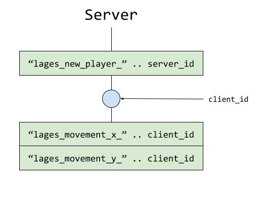
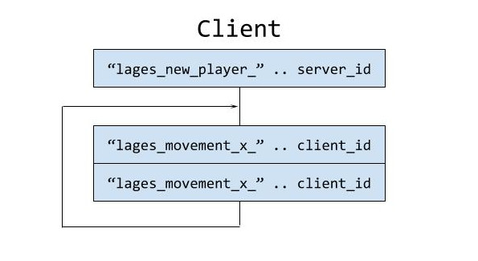
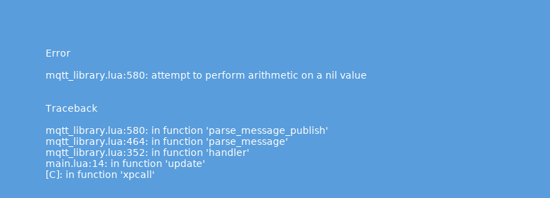

## Grupo
Leonardo Lages de Alencar - 1411485
Thiago Lages de Alencar - 1721629

# Documentação  

## Sobre  
O jogo é simplesmente você esquivar de obstáculos que estão caindo de cima, a imagem abaixo mostra um jogador (bola com cor) e obstáculos (bolas cinzas).  
  

O jogo é multiplayer e não foi implementado um limite de jogadores.  
Qualquer com o id do server pode se conectar ao jogo a qualquer momento.  
O controle para o jogo é o acelerometro do celular, ou seja, você precisa ter um celular e ele precisa estar pronto para rodar Love2d.  

## Como jogar  
Primeiro de tudo você precisar rodar o server, ele vai ficar aberto esperando jogadores se conectarem, rode com love (love server/).   
O server deve ficar exibindo uma tela preta, já que não tem jogadores.  

Para jogar você vai precisar botar o **game.love**, que se encontra na pasta client, no seu celular e depois rodar ele pelo celular.  

O mais recomendado para rodar ele pelo celular é que você baixe [LÖVE for Android](https://play.google.com/store/apps/details?id=org.love2d.android).  
Na descrição dele já inclui como rodar um arquivo .love  

Assim que você abrir o jogo com o celular ele já vai tentar se conectar ao server default (server_id = 0), então provável que o jogo comece na hora que você abrir o jogo no celular.  

## Controle
Dado que já está com o jogo aberto, você deve usar o acelerometro para se mover para esquerda/cima/baixo/direita e sobreviver a vontade.  
Caso morra, você não precisa fechar e abrir o jogo, basta dar um toque na tela para enviar outro pedido de jogador para o server.  

## Server e Client  
A conexão é feita usando [MQTT](https://en.wikipedia.org/wiki/MQTT) com a library apresentada em aula: http://geekscape.github.com/mqtt_lua  
Embora tenhamos nomeado o lado do jogador como *client* e o do jogo como *server*, ambos conseguem implementar as mesmas funcionalidades.  
**Client** tem como foco capturar as ações do jogador e passar para o server.  
**Server** recebe essas ações e utiliza para fazer o jogo.  

### Server  
  
Server inicia dando *subscribe* a um tópico dele. Esse tópico vai ser utilizado para saber se algum jogador deseja entrar no jogo.  
Se um jogador entrar no jogo, o server da subscribe a todos os tópicos daquele jogador.  

### Client  
  
A primeira coisa que o client faz é dar *publish* para o tópico do server. Dessa maneira o server sabe que aquele jogador quer jogar.  
Após isso ele fica eternamente dando publish para os tópicos dele mesmo.  

## Dificuldades  
**Muitas mensagens** - Em um jogo local, normalmente você envia sempre os movimentos do jogador, para deixar o jogo o mais atualizado/preciso. Usando a biblioteca de MQTT isso não pareceu possível.  
  
Parece que enviar a todo momento causava algum erro dentro da biblioteca.  
Tentamos duas coisas para resolver.  
 * Mandar a cada X ms a atualização do estado do jogador.  
 * Mandar apenas quando o jogador fizesse alguma atualização 'grande'  

Acabamos que ficamos com a segunda para não chegar nem perto de sobrecarregar a biblioteca MQTT

**Movimento do jogador ser em intervalos** - Como não enviavamos o tempo todo qual o movimento que o jogador está fazendo, decidimos gravar a ultima mensagem para que a gente repetisse o mesmo movimento enquanto o jogador não fizesse outro.  
Lado negativo é que se o jogador parar de jogar ou perder a conexão, o personagem dele continua por se movimentar naquela mesma direção para sempre.  

**Delay** - O tempo para a mensagem do movimento chegar no server demorava mais que o esperado. Esse problema não soubemos como corrigir, podia ser simplesmente a rota até o server que estava ruim ou que biblioteca MQTT não é boa para coisas em tempo real.  
